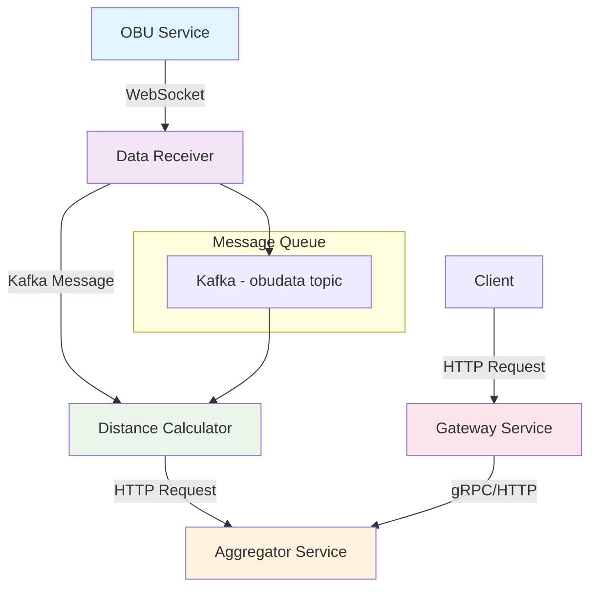
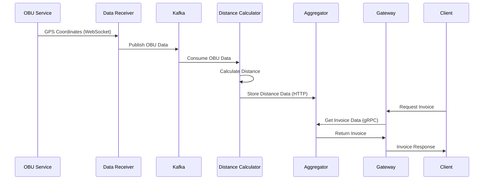
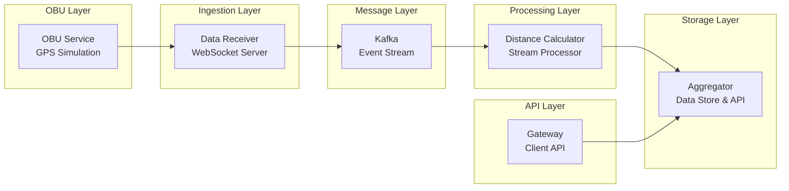

# 🚗 Toll Calculator System

A distributed microservices-based toll calculation system that processes GPS data from vehicles to calculate toll charges based on travel distance.

## 🏗️ Architecture Overview

The Toll Calculator is built using a microservices architecture with event-driven communication patterns. The system processes real-time GPS data from vehicles and calculates toll charges based on distance traveled.

### System Components

| Service | Port | Protocol | Purpose |
|---------|------|----------|---------|
| **OBU Service** | - | WebSocket Client | Simulates vehicle GPS data transmission |
| **Data Receiver** | 30000 | WebSocket Server | Receives GPS data and publishes to message queue |
| **Distance Calculator** | - | Kafka Consumer | Calculates distances between GPS coordinates |
| **Aggregator** | Configurable | HTTP/gRPC | Stores distance data and generates invoices |
| **Gateway** | 6000 | HTTP | Client-facing API for invoice retrieval |

## 🔄 Data Flow



## 🚀 Quick Start

### Prerequisites

- Docker and Docker Compose
- Go 1.19+ (for local development)

### Running the System

1. **Clone the repository**
   ```bash
   git clone <repository-url>
   cd toll-calculator
   ```

2. **Start the infrastructure**
   ```bash
   docker-compose up -d kafka zookeeper
   ```

3. **Start the services**
   ```bash
   # Terminal 1 - Data Receiver
   go run ./data-receiver

   # Terminal 2 - Distance Calculator  
   go run ./distance-calculator

   # Terminal 3 - Aggregator
   go run ./aggregator

   # Terminal 4 - Gateway
   go run ./gateway

   # Terminal 5 - OBU Simulator
   go run ./obu
   ```

4. **Get invoice data**
   ```bash
   curl http://localhost:6000/invoice?obu=1
   ```

## 📊 System Flow Diagram



## 🛠️ Technical Details

### Communication Protocols

- **WebSocket**: Real-time GPS data transmission from OBU to Data Receiver
- **Kafka**: Asynchronous message passing for GPS data processing
- **HTTP**: RESTful APIs for distance data and invoice retrieval
- **gRPC**: High-performance communication between Gateway and Aggregator

### Key Features

- **Scalable Architecture**: Each service can be scaled independently
- **Event-Driven Design**: Loose coupling through message queues
- **Middleware Support**: Built-in logging and metrics middleware
- **Polyglot Interfaces**: Multiple communication protocols for different use cases
- **Containerized Deployment**: Docker Compose for easy local development

### Distance Calculation

The system calculates straight-line distance between consecutive GPS coordinates using the Euclidean distance formula:

```
distance = √[(x₂-x₁)² + (y₂-y₁)²]
```

### Toll Calculation

Toll charges are calculated using a base rate multiplied by total distance:

```
toll_charge = base_rate(315) × total_distance
```

## 📈 Monitoring

The Aggregator service includes Prometheus metrics for monitoring:

- Distance calculations per OBU
- Invoice generation metrics
- Service health indicators

Access metrics at: `http://localhost:<agg-port>/metrics`

## 🏗️ Service Architecture



## 🔧 Configuration

### Environment Variables

| Variable | Service | Description | Default |
|----------|---------|-------------|---------|
| `AGG_HTTP_LISTEN_ADDR` | Aggregator | HTTP server address | `:3000` |
| `AGG_GRPC_LISTEN_ADDR` | Aggregator | gRPC server address | `:3001` |
| `KAFKA_BROKERS` | All | Kafka broker addresses | `localhost:9092` |

### Docker Compose

The system includes a complete Docker Compose setup with:
- Kafka message broker
- Zookeeper coordination service
- Network configuration for service communication

## 🧪 Testing

Test the system by sending a request to get an invoice:

```bash
# Get invoice for OBU ID 1
curl -X GET "http://localhost:6000/invoice?obu=1"

# Expected response
{
  "obuId": 1,
  "totalDistance": 15.24,
  "tollCharge": 4800.60
}
```

## 🚀 Deployment

For production deployment:

1. **Configure environment variables** for each service
2. **Set up Kafka cluster** with appropriate replication
3. **Deploy services** using container orchestration (Kubernetes, Docker Swarm)
4. **Configure load balancing** for the Gateway service
5. **Set up monitoring** with Prometheus and Grafana

## 🤝 Contributing

1. Fork the repository
2. Create a feature branch (`git checkout -b feature/amazing-feature`)
3. Commit your changes (`git commit -m 'Add amazing feature'`)
4. Push to the branch (`git push origin feature/amazing-feature`)
5. Open a Pull Request

## 📄 License

This project is licensed under the MIT License - see the [LICENSE](LICENSE) file for details.

---

**Built with ❤️ using Go, Kafka, and microservices architecture**
